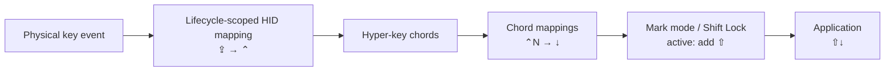

# keebs

A tiny macOS keyboard remapper for personal key mappings, Emacs-style active
mark selection, and latched hyper-key chords.

The narrow scope is: toggle a mark state, then add `Shift` to keypresses while
that state is active. Since most macOS apps already interpret shifted movement
keys as selection extension, this gives us an application-agnostic way to get
the Emacs-style active region workflow across different apps.

## Goal

Make `Ctrl-Space` behave like a lightweight Emacs active mark workflow in macOS
text fields and apps.

In Emacs terms, the relevant ideas are:

- `point`: the current cursor position
- `mark`: a saved position
- `region`: the text between point and mark
- `set-mark-command`: usually bound to `Ctrl-Space`
- `transient-mark-mode`: shows the active region as a visible selection

For this project, "mark mode" means our own keyboard-level state where movement
commands extend the current selection.

## MVP Behavior

- `Ctrl-Space` toggles mark mode.
- While mark mode is active, movement keypresses get `Shift` added.
- Configured movement bindings are applied before mark mode.
- Editing/action keys deactivate mark mode.
- Regular typing deactivates mark mode and sends the key as-is.
- A small HUD is shown while mark mode is active.

Example pipeline:

```text
Down Arrow
  -> mark mode is active
  -> add Shift
  -> emit Shift-Down Arrow
```

`keebs` maps `Ctrl-n` to `Down Arrow` before mark mode sees it. Consequently,
`Ctrl-Space Ctrl-n` follows the same path as `Ctrl-Space Down Arrow` and emits
`Shift-Down Arrow`.

## Mapping Layers

Chord mappings are defined as `KeyMapping` values in `Sources/keebs/main.swift`.
A mapping translates one key plus modifiers to another key plus modifiers. The
same translation is retained until key-up, so applications always receive a
matching down/up pair. Caps Lock is mapped to Left Control through macOS's HID
mapping facility while keebs is running. keebs removes that mapping on shutdown;
an independent watchdog also removes it if keebs is killed or crashes. To avoid
destroying user configuration, keebs refuses to install its mapping when another
HID mapping already exists.



The built-in configuration mirrors the remaining basic mappings from the
previous Karabiner-Elements configuration:

- `Caps Lock` → `Control`
- `Command-Control-H/J/K/L` → left/down/up/right
- `Command-Control-A/S/W/D` → left/down/up/right
- `Control-P/B/F/N` → up/left/right/down
- `Control-G` → `Escape`
- `Control-V` → `Page Down`; `Option-V` → `Page Up`
- `Option-B/F` → `Option-Left/Right`
- `Option-D` → `Option-Delete Forward`

Caps Lock is the only mapping outside the event-tap layer because macOS updates
modifier state before the tap receives the event.

## Initial Keys

The first version should add `Shift` to navigation keys such as:

- arrow keys
- `Page Up` / `Page Down`
- `Home` / `End`
- navigation keys with existing modifiers, such as `Option-Right Arrow` or
  `Command-Left Arrow`

The initial configuration includes the Emacs movement bindings that previously
lived in Karabiner-Elements.

## Deactivation

The first version should deactivate mark mode on:

- `Escape`
- `Ctrl-g`, emitting `Escape`
- `Delete` / `Backspace`
- `Command-x`
- `Command-v`
- mouse click
- app switch
- regular typing, with the typed key sent unchanged

Typing letters should not get `Shift` applied. Caps Lock already exists for
that. A typed character should leave mark mode and pass through unchanged.

## Hyper Chords

`Right Command` acts as a personal hyper key. Tap it to open a HUD and latch
hyper mode, then release it and enter the chord normally. The real Command
modifier is suppressed so apps do not see it. Pressing `Right Command` again
cancels hyper mode.

The current chord map is hardcoded:

- Tap `Right Command`, then `r`: Raycast layer
  - `w`: `open -g raycast://extensions/raycast/navigation/switch-windows`
  - `c`: `open -g raycast://extensions/raycast/clipboard-history/clipboard-history`
  - `k`: `open -g raycast://extensions/raycast/raycast/confetti`
  - `s`: `open -g raycast://extensions/raycast/snippets/search-snippets`
  - `i`: `open -g raycast://extensions/raycast/screenshots/search-screenshots`
  - `n`: `open -g raycast://extensions/raycast/raycast-notes/raycast-notes`
- Tap `Right Command`, then `a`: Applications layer
  - `t`: `open -a Ghostty`
  - `e`: `open -a "Visual Studio Code"`

Completing a chord launches the target with `/usr/bin/open`, closes the HUD, and
exits hyper mode immediately. Pressing an unknown key while the HUD is open also
closes the HUD, consumes the key, and does nothing.

## Non-Goals

- General Karabiner JSON compatibility
- Device-specific rules
- App-specific rules
- Input-source rules
- Mouse key emulation
- Multiple profiles

Those can come later if they become useful, but the project starts with the
active mark workflow only.

## Alternatives

### Karabiner-Elements

Karabiner-Elements can already approximate this workflow, but the configuration
becomes awkward because mark mode has to redefine every movement binding with
`Shift` added. This project tries a smaller model: keep movement bindings
elsewhere, and only add `Shift` while mark mode is active.

## Likely Implementation

Start with a small Swift daemon using a `CGEventTap`.

The event pipeline is:

```text
read keyboard event
  -> normalize key and modifiers
  -> handle hyper-key chords and app launchers
  -> apply configured key mappings
  -> handle mark mode toggles/cancellations
  -> if mark mode is active and event is navigation, add Shift
  -> if mark mode is active and event is typing/action, deactivate mark mode
  -> emit synthetic event or pass through original
```

If a pure event tap is not reliable enough for modifier behavior, we can later
add a virtual HID backend. That should be a later step, not part of the first
prototype.

## Running

Build the daemon:

```sh
swift build
```

Run it:

```sh
swift run keebs --debug
```

The first run needs permissions in System Settings > Privacy & Security:

- Accessibility
- Input Monitoring

After granting permission, restart the daemon.

For event-level debugging, run:

```sh
swift run keebs --trace
```

If `Ctrl-Space` does not appear in the trace, macOS or another tool may be
handling it before the annotated session tap. Try the earlier session tap:

```sh
swift run keebs --trace --tap session
```

The default is:

```sh
swift run keebs --trace --tap annotated
```
